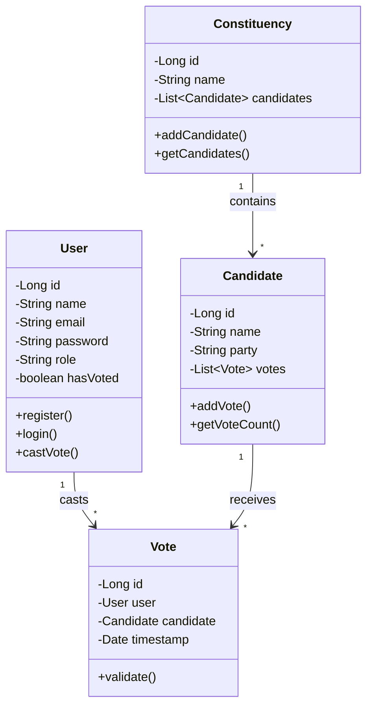

# DigiElect - Secure Online Voting System 🗳️

<div align="left">


**Developed by Phoenix Coders Team**

</div>

---

## 👥 Team Members

| Name | Roll Number |
|------|-------------|
| **Jagan Sunkavalli** | 2420030714 |
| **Reddam Srijitha** | 2420030741 |
| **Cheyati Hemavathi** | 2420030745 |
| **Kistammagari Pranathi Reddy** | 2420030751 |

---

## 📋 Project Overview

**DigiElect** is a secure and scalable online voting platform built using **Java 17+** and **Spring Boot 3.x**. This project showcases core **Object-Oriented Programming** principles and implements industry-standard **SOLID design principles** along with common design patterns like **Factory** and **Strategy**.

### 🎯 Key Highlights

- ✅ **Secure one-person-one-vote mechanism**
- ✅ **Role-based access control** (VOTER, ADMIN)
- ✅ **Concurrency-safe vote submissions**
- ✅ **Real-time vote analytics** using Java Streams
- ✅ **Serialization utilities** for election state persistence
- ✅ **Robust JUnit 5 test coverage** (>80% for core logic)

---

## 🛠️ Technology Stack

### Backend
- **Java 17+**
- **Spring Boot 3.x**
  - Spring MVC
  - Spring Security
  - Spring Data JPA
- **Hibernate ORM**
- **H2** (in-memory) or **MySQL** (optional)
- **Maven** (Build & Dependency Management)
- **Lombok** (Boilerplate Reduction)

### Frontend (Minimal)
- **Thymeleaf** Templates
- **Bootstrap 5**
- **HTML/CSS/JavaScript**

---

## 📁 Project Structure

```
com.digielect/
│
├── 📂 config/              # Security & application configurations
│   ├── SecurityConfig.java
│   └── CustomConfig.java
│
├── 📂 controller/          # MVC Controllers
│   ├── HomeController.java
│   ├── UserController.java
│   ├── VoteController.java
│   └── AdminController.java
│
├── 📂 entity/              # JPA Entities
│   ├── User.java
│   ├── Candidate.java
│   ├── Vote.java
│   └── Constituency.java
│
├── 📂 repository/          # Spring Data JPA Repositories
│   ├── UserRepository.java
│   ├── CandidateRepository.java
│   ├── VoteRepository.java
│   └── ConstituencyRepository.java
│
├── 📂 service/             # Business Logic Layer
│   ├── UserService.java
│   ├── VoteService.java
│   ├── CandidateService.java
│   └── impl/
│       ├── UserServiceImpl.java
│       └── VoteServiceImpl.java
│
├── 📂 strategy/            # Vote Counting Strategy Pattern
│   ├── VoteCountingStrategy.java
│   ├── SimpleCountStrategy.java
│   └── WeightedCountStrategy.java
│
├── 📂 factory/             # Factory Pattern Implementations
│   ├── ElectionFactory.java
│   └── ConstituencyFactory.java
│
├── 📂 utils/               # Utilities
│   ├── SerializationUtil.java
│   └── ValidationUtil.java
│
└── DigiElectApplication.java  # Main Spring Boot Entry Point
```

---

## 📊 UML Class Diagram



---

## 🔐 Security Architecture

| Feature | Implementation |
|---------|----------------|
| **Authentication** | Spring Security with session-based auth |
| **Password Security** | BCryptPasswordEncoder (strength 10) |
| **Authorization** | Role-based access control (RBAC) |
| **CSRF Protection** | Enabled by default for all POST requests |
| **Vote Integrity** | Atomic transactions prevent double voting |
| **Session Management** | HTTP sessions with fixation protection |

### Authentication Flow

```
User Registration → BCrypt Hash Password → Store in Database
         ↓
User Login → Spring Security Validation → Create Session
         ↓
Access Protected Routes → Role Check → Grant/Deny Access
```

---

## ✨ Features

### 🗳️ Voter Features
- ✅ Register with unique email/phone
- ✅ Secure login with username or email
- ✅ View candidates by constituency
- ✅ Cast **one secure vote** per election
- ✅ View voting status and confirmation

### 👨‍💼 Admin Features
- ✅ Manage election lifecycles
- ✅ Create and manage constituencies
- ✅ Monitor **real-time vote counts**
- ✅ View detailed analytics with **Java Streams**
- ✅ Ensure election integrity and security
- ✅ Access comprehensive admin dashboard

---

## 🚀 How to Run

### Prerequisites
- ☕ **Java 17+** ([Download](https://www.oracle.com/java/technologies/downloads/))
- 📦 **Maven 3.6+** ([Download](https://maven.apache.org/download.cgi))
- 🗄️ **MySQL 8.0+** (Optional - H2 embedded DB available)

### Installation Steps

1️⃣ **Clone the repository**
```bash
git clone https://github.com/Jagan-Dev-9/OOPA_Project.git
cd OOPA_Project/VotingApp
```

2️⃣ **Configure Database** (Optional - Skip for H2)
```properties
# src/main/resources/application.properties
spring.datasource.url=jdbc:mysql://localhost:3306/voting_db
spring.datasource.username=root
spring.datasource.password=yourpassword
```

3️⃣ **Build the project**
```bash
./mvnw clean install
```

4️⃣ **Run the application**
```bash
./mvnw spring-boot:run
```

5️⃣ **Access the application**
```
🌐 Visit: http://localhost:8080
```

---

## 🧪 Testing

Our test suite covers:
- ✅ User registration and authentication
- ✅ Vote submission and concurrency handling
- ✅ Vote tallying strategies
- ✅ Security configurations
- ✅ Database operations

### Run Tests
```bash
./mvnw test
```

### Coverage Goal
> **Target:** >80% backend code coverage

---

## 🎨 Design Patterns Used

| Pattern | Usage | Location |
|---------|-------|----------|
| **Factory** | Creating elections and constituencies | `factory/` package |
| **Strategy** | Different vote counting algorithms | `strategy/` package |
| **Singleton** | Application configuration | Spring Beans |
| **Repository** | Data access abstraction | `repository/` package |
| **MVC** | Web application architecture | Spring MVC |

---

## 🔮 Future Enhancements

- 🗓️ **Multi-election scheduling** and management
- 🔐 **Two-factor authentication (2FA/MFA)**
- 📡 **Real-time WebSocket** results updates
- 📊 **Exportable audit reports** (PDF/CSV)
- 🌐 **Distributed databases** and caching (Redis)
- 📱 **Mobile application** support
- 🔍 **Advanced analytics dashboard**
- 🌍 **Multi-language support**

---

**Made with ☕ by Phoenix Coders**

</div>
